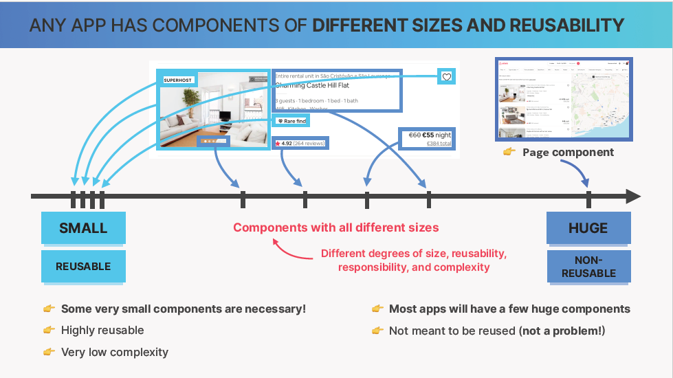

# Overview

This time is going to be how to think components, composition, and reusability

# Lesson II (Setting up a new project called use popcorn)

Just an abstraction about the project that we are going to build

# How to split a UI into component

Q ) How to split a UI into component and when should we create a new component ?

one way ) is by looking at component size so we can classify every component based on its size, which means that we can place every component on axis of component size.

at many times, none of these extremes(huge or small) are ideal.

imagine that we want to build this simple card in the picture.

- one way of building would be create just one huge componenet for the entire card. ( that will create a whole set of problems [first, there is way too much stuff going on in this component, so it has way too many responsibilities ], [second, the component is too large when it receives too many props in order to work properly ] ). so in general these two problems make it too hard to reuse the component which is the advantage of components in the first place.

Does that mean we should use the opposite and create many small components like this one on the left side

- another way (create many small components) / that would probably also a big terrible idea as well.
  if we would build a UI for the entire app in this way we would end up with 100 or 1000 of components, Too abstracted, confusing codebase.

So most of the times, the goal is to create components that strike the right balance between being too specific and too board (Large and small)

- prefer coding style / as you like some people just prefer larger component and some people prefer smaller component. so create the component in a way that works best for you so that you can stay as productive as possible.

#### Let's actually dig a bit deeper in these criteria

Something like a framework that helps create a new components from bigger components.

- the idea when you're creating a new component and you're in doubt about what the component should include, just start with relatively big component and then split this bigger component into smaller components as it becomes necessary.
  So when does it become necessary ?
  there are 4 criteria comes into play again in this pic :-

#### A few more general guidelines

