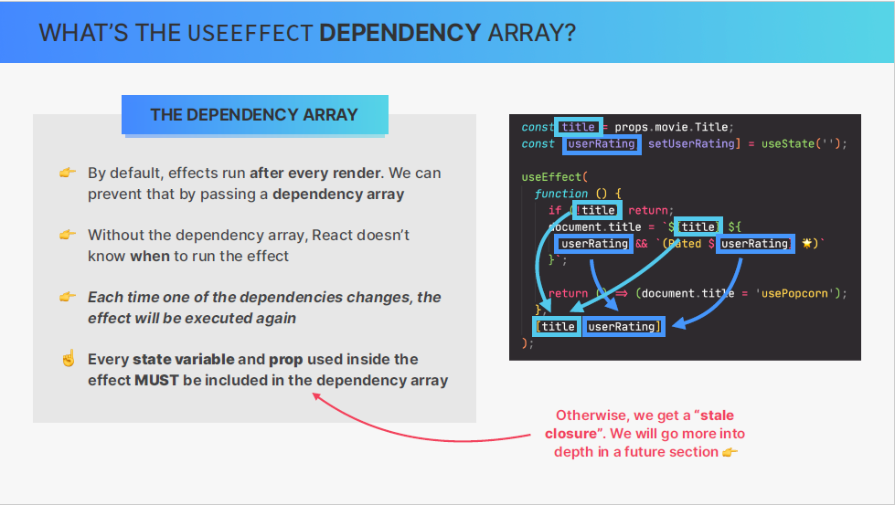
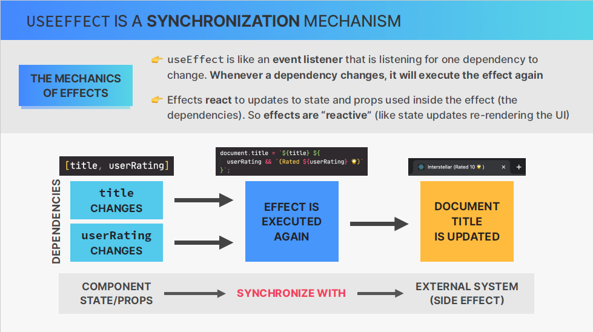
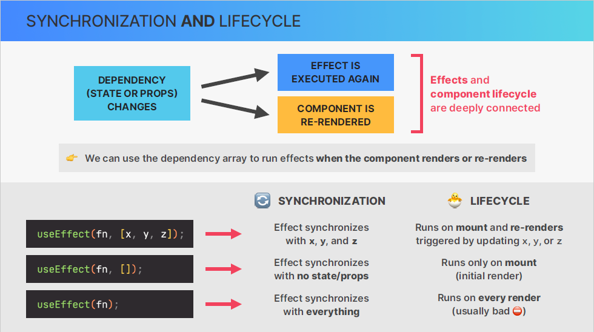
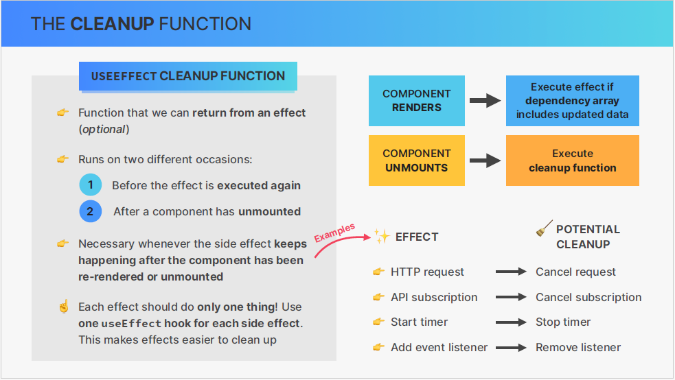
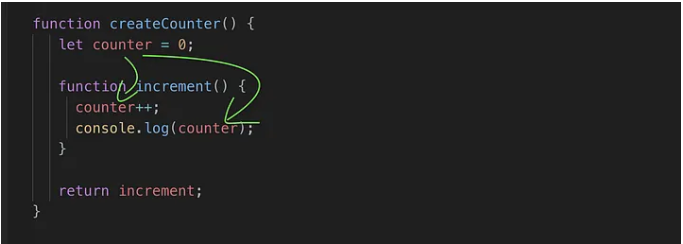

## Overview

Data fetching is an essential skills on building web applications. so this section is all about effects ( one way of fetching data in react apps ). focus on useEffect hook.

## Component lifecycle

the life cycle of a component basically encompasses the different phases that a specific component instance can go through over time and
1- the first phase is that a component instance is mounted/rendered for the first time.

2- once the component has been rendered and is on the screen it can be re-rendered an unlimited number of times

3- the component is no longer needed and so that's when the component is unmounted. this can happen when user navigates to another page or he closes the app


why was it even worth learning about this now ?

It's important to know about the component life cycle because we can hook into different phases of this lifecycle.We can define code to run at these specific points in time. and we can do so by useEffect hook.

## How not to fetch data in react

we are going to fetch data in the wrong way which is going to be the great learning experience
look at the code [here](./usepopcorn/src/App-wrong-way.tsx)

as we learned, we should never update the state in render logic. so let's break that rule so we can see why it's actually exist in the first place.

"Breaking rules like this is a great way to learn react and its rules"

## useEffect hook to rescue

the idea of useEffect hook is to give us a place where we can safely write side effects.
But the side effects registered with the useEffect hook will only be executed after certain renders.
For example, only write after the initial render.

[look here the code in practice](./usepopcorn/src/App.tsx)

## A first look at effects

What actually is an effect and how is it different from event handler function ?


## Adding async await function , adding a loading state, handling errors look at the code,

## the useEffect dependency array







effects are executed after renders (this is not wrong, and also not the full story).
so let's look at the timeline of events that happen as component renders and re-renders.
so as we already know the whole process starts with mounting the component instance, after that
the result of rendering is commited to the dom and finally the dom changes painted onto the screen by the browser.
So where do effects come into play here ?
Well, effects are actually only executed after the browser has painted the dom onto the screen. So not immediately after render, that's why we say that effects run asynchronously after the render has been painted to the screen.

and the reason why effects works this way is that effects may contain long time processes such as fetching data.

an important sequence of the fact that effects don't run during the render is that if an effect sets state, then the second additional render will be required to display the UI correctly.

so you should not overuse effects


## useEffect cleanup function

remember that after the last effect run, the title of the page in the browser tab was set to the last name of the movie you choosed even you didn't need it (unmounted component).

so, once we unmount component we would probably like the title to return to the original text which was simply usePopcorn.

so we keep the page title is synchronized with the application so after the component unmount.
so we do that by returning a so called cleanup function from the effect and in this case that simply a function that sets title back to the original




it runs in two ocassions :-
first before the effect is executed again to cleanup the results of the previous side effect
second after the component has unmounted in order to give us the opportunity to reset the side effect that we created if that's necessary.

so, we do need cleanup function whenever the side effect keeps happening after the component has been re-rendered or unmounted for example, when doing http request on the effect and if the component if re-renderd after the first request is still running, a new second request will be fired off, this may create a bug called (race condition) more on that below 👇🏾
so, it's a good idea to cancel the request in a cleanup function whenever the component re-renders or unmounts.

more example on the pic (09)

#### One important rule about effects

each effect should only do one thing, so if you need multiple effects in your components, which is completely normal just use multiple useEffect hooks.
this not only makes each effect much easier to understand but also easier to cleanup by using cleanup function.

## Cleaning up data fetching to get rid of race condition (if exists)

there are three problems with many requests at the same time :-
first => slow each of them down
second => we will end up downloading way too much data because w don't interested in the data for other queries. (affects on your internet Gigas in big apps)
third (the most important one) => race condition, if the previous requests arrived after the last one (which we need) it will be rendered on the state (and that what we don't want)

so we need to cleanup the requests so that as soon as a new request is fired off, the previous one will stop

we need to do that a native browser api, called abort controller ( more about it 👇🏾 )
and we will use it in our cleanup function

give a look to the code [here](./usepopcorn/src/App.tsx)

so if at some point in the future, if you're doing http requests and effects like this make sure to cleanup after your fetch requests, in case that you have a situation where many requests can be fired off very rapidly, one after another, which exactly the situation that we have here.

you note that in code

```
useEffect(function(){
    const fetchFunc = async () => {
        try{
        const controller = new AbortController();
        await fetch('url',{signal: controller.signal}) // this will throw an error auto which has name "AbortError" so you need to check if it is don't set the error state with it and also setError('')
        setError("");
        }catch(err){
            if(err.name !== "AbortError") setError(err.message)
        }
    }
    return function(){
        controller.abort();
    }
})
```

## Listen to keypress event listner

to listen to keypress we need to globally listen to keypress event. so we will attach the event listener to the entire document. we will deal directly with DOM and this is clearly the side effect so we need a another effect

note that we just need it globally (over the component level) so we need to touch DOM but if you need some event that attached to some elements so you won't need to deal directly with DOM

But now if you did some tests such as log something after this event you will see that the event listener is executed more and more times as if it's an accumulator and the more you listen to the event the more it's executed more and more times and you will get dozens of logs after listening one time.

And the reason for that each time that the new movie details compoonent mounts, a new event listener is added to the document. So each time that the effect is executed, it will basically add one more event listener to the document. (it might become memory problem in larger applications with hundreds or thousands of event listeners)

so we need to cleanup the event listener.

```
return function(){
    document.removeEventListener("keydown",the_same_prev_function);
}
```

### Questions

### race condition

Race conditions can occur if the application logic depends on the order of responses. For example, if the application expects to receive responses in a particular order and performs actions based on those responses, receiving responses out of order could result in unpredictable behavior.

// generally
A race condition is an undesirable situation that occurs when a device or system attempts to perform two or more operations at the same time, but because of the nature of the device or system, the operations must be done in the proper sequence to be done correctly.

Race conditions are most commonly associated with computer science and programming. They occur when two computer program processes, or threads, attempt to access the same resource at the same time and cause problems in the system.

Race conditions are considered a common issue for multithreaded applications.

### clousers in javascript

In JavaScript, closure means that an inner function can access variables that belong to the outer function. This applies even when the execution of the outer function has already finished.



```

```
