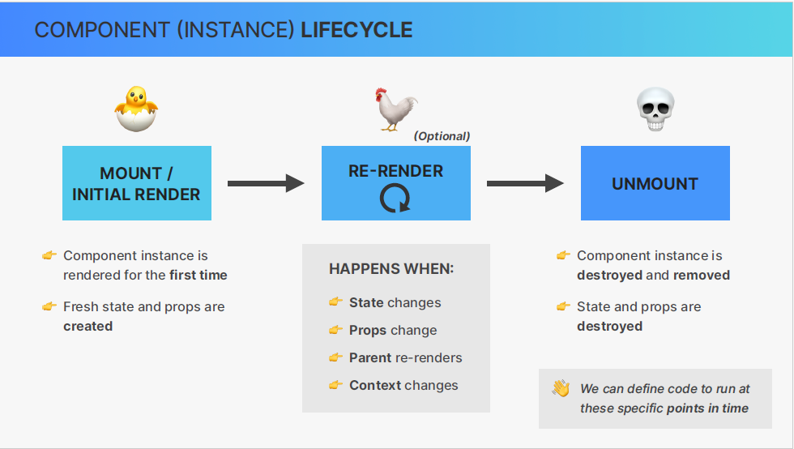
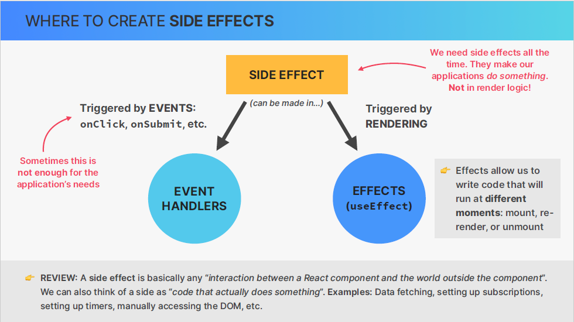
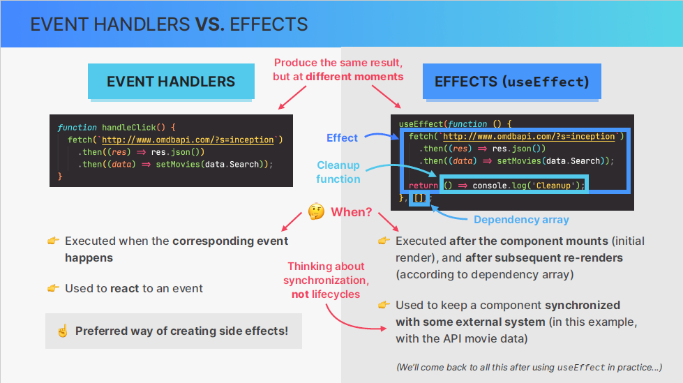

## Overview

Data fetching is an essential skills on building web applications. so this section is all about effects ( one way of fetching data in react apps ). focus on useEffect hook.

## Component lifecycle

the life cycle of a component basically encompasses the different phases that a specific component instance can go through over time and
1- the first phase is that a component instance is mounted/rendered for the first time.

2- once the component has been rendered and is on the screen it can be re-rendered an unlimited number of times

3- the component is no longer needed and so that's when the component is unmounted. this can happen when user navigates to another page or he closes the app

why was it even worth learning about this now ?

It's important to know about the component life cycle because we can hook into different phases of this lifecycle.We can define code to run at these specific points in time. and we can do so by useEffect hook.

## How not to fetch data in react

we are going to fetch data in the wrong way which is going to be the great learning experience
look at the code [here](./usepopcorn/src/App-wrong-way.tsx)

as we learned, we should never update the state in render logic. so let's break that rule so we can see why it's actually exist in the first place.

"Breaking rules like this is a great way to learn react and its rules"

## useEffect hook to rescue

the idea of useEffect hook is to give us a place where we can safely write side effects.
But the side effects registered with the useEffect hook will only be executed after certain renders.
For example, only write after the initial render.

[look here the code in practice](./usepopcorn/src/App.tsx)

## A first look at effects

What actually is an effect and how is it different from event handler function ?

## Adding async await function , adding a loading state, handling errors look at the code,

## the useEffect dependency array
