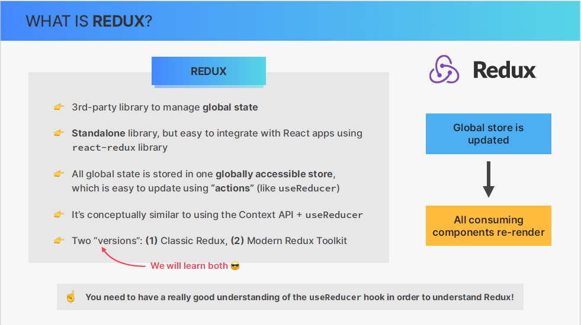
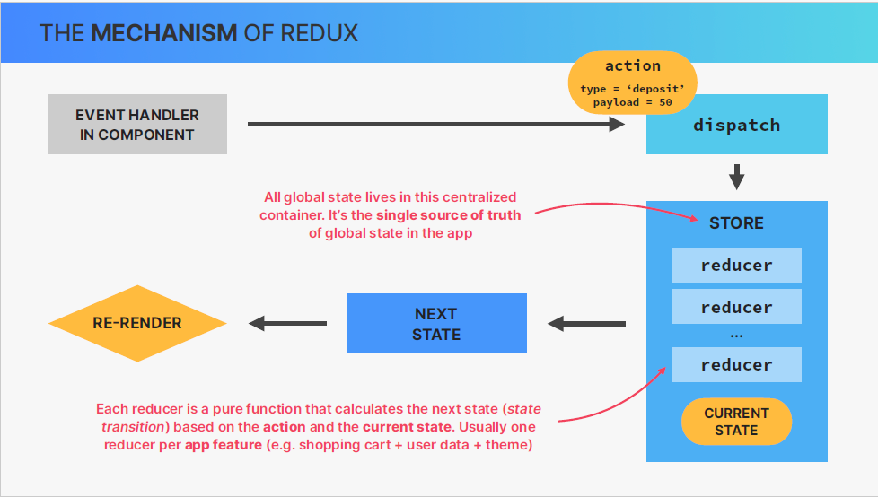

# Redux and Redux toolkit section

## lesson 1

let's get into one topic of the big course (redux).
For many peoples redux is big and kind of scary thing that find impossible to learn.
For you however it's the opposite because you already know useReducer hook works and therefore learning redux is actually going to be quite straightforward and a lot of fun.

so to make it really easy we're gonna start at the very fundamentals by learning redux in isolation and then use it in small application and convert it to more modern redux toolkit and we even gonna make api requests right inside redux using thunks.

## lesson 2

as always, let's start by getting a good understanding of what Redux actually is and how the mechanics of redux work especially when compared with the userReducer hook.

in fact, many developers even say that the context api is the replacement for Redux.
However, the truth is a bit more nuanced than that as we will discuss by the end of the section once you have some experience with both of these tools.

Let's quickly review useReducer mechanism

so with useReducer when we want to update state from an event handler in a component, we start by creating an action, this action is simply an object that usually contains type and payload which is information about how the state should be updated we then dispatch this action to a so called reducer function. the reducer takes the type and the payload and together with the current state calculates the next state, so the new state value and to finish as state updates the component will re-render

we're gonna add two more things onto this in order to learn how redux works.

#### Store

so the first difference between useReducer and redux is that in redux we actually dispatch actions not simply to reducer but instead to a store. So this store is a centralized container where all global state lives. It's like the single source of truth of all global state across the entire application.

The store is also where on or multiple reducers live.

#### Pure Function

just as a reminder each reducer must be a pure function that has the single task of calculating the next state based on the action that was dispatched to the store and the current state that's already in the store as well.

Q) Now, you might be wondering why is there multiple reducers int this store ?

A) it's because we should create one reducer per application feature or per data domain to keep things separated e.g.) in a shopping app, you could have one reducer for the shopping cart, one for some user data, and one for application color theme.

Finallly, any component that consumes the state that has been updated in the store will as always get re-rendered by react at least if we're assuming that reusing Redux together with a react app.

#### Action

Let's focus on the action again, so in the real world when we use Redux we usually use function called action creators in order to automate the process of writing actions. So basically, instead of always writing these action objects by hand, we create functions that do this automatically. This has the advantage to keep all actions in one central place which reducer bucks because developers don't have to remember the exact action type strings.

Just note that this is optional and not a feature of Redux it's just how we build real world apps.

## lesson 3

Creating a reducer bank account ( look at the code ) [here](./redux-intro/src/store.ts)

## lesson 4

Create the redux store ( look at the code )

## lesson 5

Function Creators

## lesson 6

Adding more state: Customer

## lesson 7

Professional Redux File Structure: State Slices

## lesson 8

Back to react, connecting our redux file to react

## lesson 9

Dispatching actions from our react app

## Questions

#### q) the difference between redux and useContext

Redux Pros for Many UI Global States:

Centralized Store: Redux keeps all your global state in one place, making it easier to track and reason about how your application changes.
Predictable Updates: Updates to the state are handled through pure reducer functions, ensuring predictable and consistent behavior.
Testability: Redux's architecture promotes writing isolated and testable state logic.
Scalability: Redux scales well for complex applications with numerous interdependent state changes.
Redux Cons to Consider:

Complexity: Setting up and learning Redux has a steeper learning curve compared to built-in React hooks.
Boilerplate: Redux requires more boilerplate code for actions, reducers, and store setup.
Overkill for Simple Apps: For smaller applications with limited global state, Redux might be an unnecessary overhead.
Alternatives to Redux for Simpler Scenarios:

useContext: As you mentioned, useContext can be a lightweight and effective way to share state across a few components.
React State Management Libraries: Libraries like Zustand or MobX offer simpler APIs compared to Redux while still providing features for global state management.
So, When is Redux Ideal?

Redux shines in these scenarios:

Large applications with extensive global state: When your app has numerous interconnected UI state pieces that need to be shared and updated across various components.
Complex state updates: If your state updates involve complex logic or dependencies between different parts of the state.
Need for advanced features: When you require features like middleware for asynchronous operations, time-travel debugging, or complex state normalization techniques.

## Vocabulary

crystal clear -> واضحة وضوح الشمس
