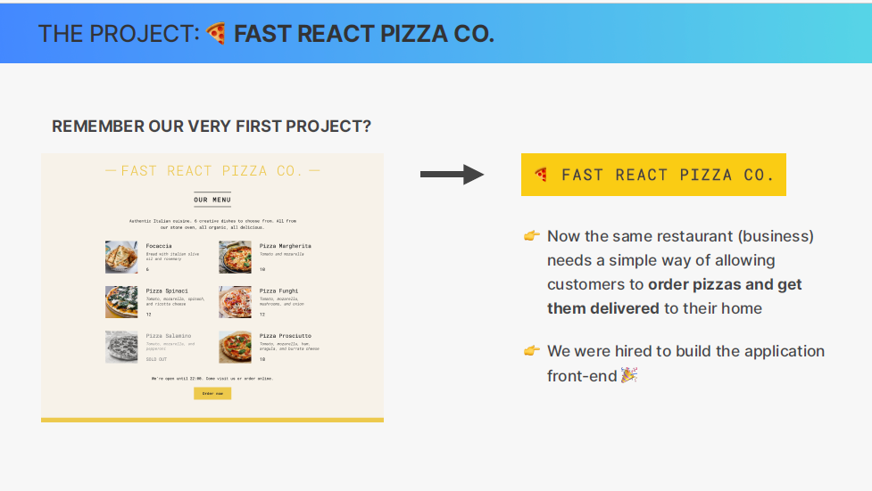
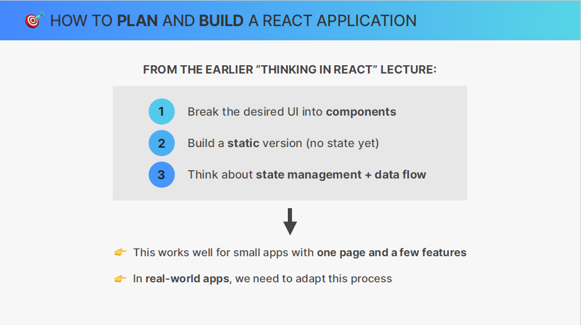
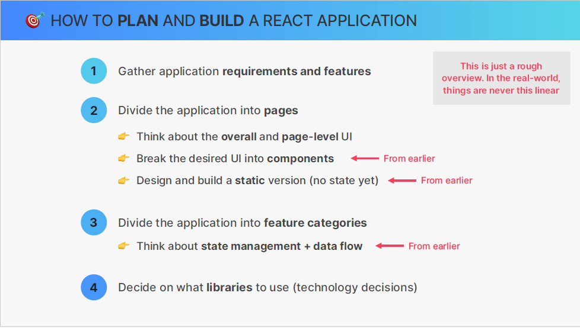
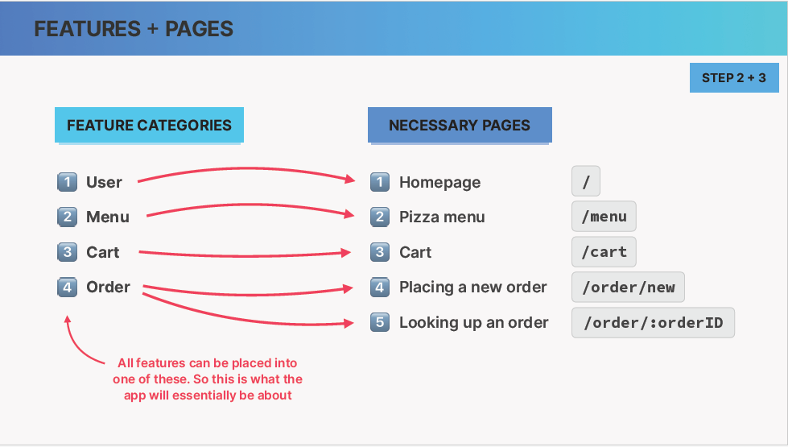

# React Router with data loading

## lesson 1 ( intro )

- in this first project we're gonna go back to react router and in particular, we're gonna make use of the modern data loading capabilities of react router in this really cool pizza ordering project. we'll also talk about how to actually plan a professional React project which is something that we haven't done in all previous projects so this time we're actually getting a bit more serious.

## lesson 2 ( Setting up a new project "Fast React Pizza Co." )

setting the app with vite and set eslint

## lesson 3 ( Application Planning )

- How we can plan a professional react application for a real client step by step but before we do that let's introduce our new fictional client

- we are going to do that using react. So for some reason they already have the backend api built, and so our only job will be to build the frontend ( the visible part of this application )

Now, building a complete application like this from scratch is of course a bit intimidating and so let's learn how we can break this process into multiple steps.

Let's actually start from what we learned earlier in [Thinking in react lecture](../sec-07-Thinking-In-React-state_management/)

- we can build simple react project by 👇🏾

Let's see how can we adapt it a little bit.
So when we build a large and more real world application we need to start by

from ☝🏾 number (3) we basically need to place all the features into a few categories, so that we can then build the application around those and so that we can organize our code in a logical way

number (4) called the technology decision

#### this is just a rough overview, so in the real world, things are never this linear but still this is a good overview

Let's now quickly go through these four steps here one by one and apply them to the application that we're gonna build and we're gonna start with ( business requirements ) so basically with everything that the business expects from this application

so this is the list of requirements that our application will need to satisfy but of course this is still a bit confusing so we don't really know how to build our application just from this, how ever from these requirements we can understand what features we actually need to implement and so let's take a look

## Questions

1. when I used vite I get some options ( typescript , typescript with swc, js , js with swc ) what does that mean

ans) I'd be glad to explain the options you see when using Vite for project setup, specifically regarding TypeScript (TS) and SWC:

Vite and Project Setup

Vite is a popular frontend build tool known for its blazing-fast development experience. It leverages native browser features like ES modules for direct import in development, eliminating the need for a bundler in this phase. However, for production builds, Vite still needs to bundle your code for compatibility with older browsers.

Understanding the Options

When setting up a new Vite project, you'll encounter options related to your preferred language and transpiler:

TypeScript (TS): A superset of JavaScript that adds static typing for improved code safety, maintainability, and tooling support. It's a popular choice for large-scale or complex projects.
JavaScript (JS): The traditional scripting language for web development. Vite can handle plain JS files directly.
SWC: Stands for "Speedy Web Compiler." It's a fast and Rust-based JavaScript/TypeScript transpiler that can be used with Vite as an alternative to Babel.
The Offered Choices

Here's a breakdown of the specific options you see:

TypeScript: This option sets up your project for using TypeScript. Vite will automatically transpile your TS code into vanilla JavaScript during the build process.
TypeScript with SWC: Similar to the first option, but it uses SWC for transpiling instead of the default Babel. SWC often offers faster transpilation times, especially for large projects.
JavaScript: This option is for pure JavaScript projects. No transpilation is needed in development, and Vite will bundle the JS files directly for production.
JavaScript with SWC: This option is for JS projects that want to leverage SWC's potential performance benefits for building the production bundle.
Choosing the Right Option

The best option for you depends on your project's requirements:

TypeScript Enthusiast: If you prefer the safety and tooling benefits of TypeScript, choose either option 1 (Babel) or 2 (SWC) based on your preference for transpilation speed.
Vanilla JavaScript Project: If you're comfortable with plain JavaScript, opt for option 3 (plain JS) for a more streamlined setup. Consider option 4 (JS with SWC) if you want to explore SWC for faster builds.
Additional Considerations

Existing Project Type: If you're converting an existing project, the choice depends on whether it's already using TypeScript.
Community Support and Plugins: Both Babel and SWC have active communities and plugins. Research which one aligns better with your project's needs or future plans.
I hope this comprehensive explanation helps you make an informed decision when setting up your Vite project!

2. so here we used swc to get it fast

You're absolutely right! When setting up your Vite project with the "TypeScript with SWC" or "JavaScript with SWC" option, you're choosing performance as a key priority. SWC excels in offering faster transpilation times compared to Babel, especially for larger projects.

Here's a quick recap:

SWC: A fast and Rust-based JavaScript/TypeScript transpiler.
Babel: A more established JavaScript/TypeScript transpiler with a vast ecosystem of plugins, but potentially slower transpilation speed.
While Babel has a wider range of plugins, SWC is catching up rapidly. If your project doesn't require any specific plugins that are exclusive to Babel, then SWC is a great choice for a speedier development experience in Vite.

Here are some additional points to consider:

Project Size: If you anticipate your project growing significantly in the future, SWC's speed advantage becomes even more valuable.
Community and Resources: Babel has a more mature community and broader documentation, but SWC's community is growing quickly as well. You can always explore both options and see which one feels more comfortable for you.
Ultimately, the choice between SWC and Babel depends on your specific needs and preferences. By understanding their strengths and weaknesses, you can make an informed decision for your project's setup within the fast-paced environment of Vite.

3. so if the swc is fast why didn't it chosen automatically because it is best

There are a few reasons why SWC isn't the default transpiler in Vite, even though it offers faster speeds:

Maturity and Stability: While SWC is a promising project, Babel has been around for a much longer time and has a more established track record. This means Babel has likely encountered and addressed more edge cases and potential compatibility issues.

Plugin Ecosystem: Babel has a much larger ecosystem of plugins available. These plugins provide additional functionalities beyond basic transpilation, like supporting specific frameworks or libraries. If your project relies on a non-standard feature or library, there might be a Babel plugin that handles it, while SWC might not have a similar option yet.

Backward Compatibility: Vite aims to cater to a wide range of project requirements, including those that might have dependencies or workflows built around Babel. Making SWC the default could potentially cause compatibility issues with existing projects or tools that rely on Babel's specific behavior.

Community and Adoption: Babel has a much larger and more established community. This means there's a wider range of resources, tutorials, and troubleshooting guides available for Babel. While SWC's community is growing, it might still be easier to find help with Babel-related issues.

Balancing Speed and Stability: While speed is crucial, stability is equally important. Vite might prioritize the stability and broader compatibility of Babel by default, ensuring a smooth experience for a wider range of users. However, Vite provides the option of choosing SWC for projects that value speed above all else.

In summary, while SWC offers undeniable performance advantages, Vite considers a balance of various factors. By making Babel the default, Vite ensures a more predictable and well-supported experience for a broader audience, while still offering SWC as an option for those who prioritize speed.

## vocabularies

intimidating -> مخيف
rough overview -> نظرة عامة تقريبية
