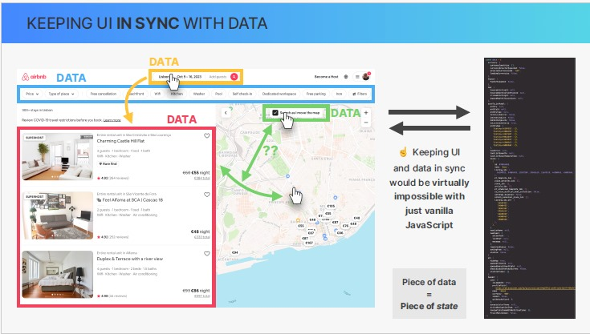
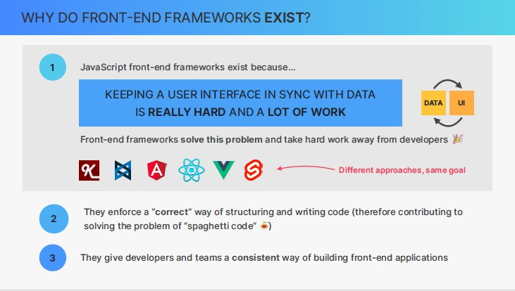

## (1) Why react

#### (a) How websites were built in the past ? How we transitioned to the new way ? How that lead to the rise of frontend frameworks ?

Before 2010 , all websites are rendered by the server (Server side rendering)

A resulting HTML, CSS and javascript from the server is sent to the client side and painted on the web page by browsers

An Example: Wordpress

javascript is included in these pages to add simple dynamics to the page, add some animations and somthing like that.
And usually a very popular library at the time called jQuery was used for this because it makes javascript work the exact same way across all browser back then.

However, overtime developers started writing more and more javascript code to be excuted by the browser, until at some point these became fully fledged web applications which then led to the rise of so called single page applications.

so these are basically webpages that are rendered on the client side not the server.
so it shifted from the server to the client.

so now we don't call these webpages anymore but instead web applications.
now this web application needs to use the data which usually come from backend in the form of an API.

these spa feels that you are using a native desktop or mobile application.so you can click on links or submit forms without the page ever reloading. so you're technically on the same page and therefore it's calles single page application.

But Server side rendering is actually making a comeback right now. so it's slowly getting modern again driven by frameworks that are given by the top of the modern client side rendering frameworks such as Nextjs, Remix and others.

##### (b) How do we build single page applications ?

we don't want to build it with vanilla javascript because there are actually several problems when we build large scale applications with vanilla js

- First Let's establish that any frontend application is about handling data then displaying that data in a nice user interface and user interface needs to stay in sync with the data and it's very hard problem to solve
  
  

1- Because it requires a large amount of direct DOM traversing and manipulation and this is guaranteed to become a absolute nightmare in complex applications because our code become extremly complex and hard to understand and we will probaly end up with the huge mess spagetti code

2-states (such as simple text or numbers) is usually stored in the DOM,so right in the HTML elements themselves rather than in central place in the application. and this make the spaggti code even harder to understand and even worse and it'll most certainly introduce many bugs into our application.

so at this point, you might as well just use
a battle tested framework like react.

##### (c) Why do frontend frameworks exist ?

## (2) React vs. vanilla js

To get the first feeling of how react keep user interface sync with state let's compare the advice app that we built in the first section with a vanilla js implementation and reactjs.

[codesandbox link](https://codesandbox.io/s/react-first-app-advice-52879f)

1- They have very different philosophy
2- every element in html you need to give it a class to select it by javascript while you don't need that with react
3- you select elements manually by js and give give them conntent manually but you don't need that in react
4- you might say this is small there is no need to react and this is true for small applications like this but as soon as we get just a little bit bigger it starts kind of getting out of control so you have to selecting tons of elements and updatign them manually and make a lot of code that with react we don't need this

## (3) what is react

## (4) setting up a new react apps

### (5) some questions

###### is vuejs client side rendering or server side

###### ChatGPT

- Vue.js is a JavaScript framework primarily designed for client-side rendering. This means that Vue.js applications run in the browser and generate the user interface on the client side. The browser downloads the necessary HTML, CSS, and JavaScript files and processes them to render the application.

- However, Vue.js can also be used for server-side rendering (SSR) through a separate package called "Nuxt.js." Nuxt.js is a framework built on top of Vue.js that allows you to create universal applications with server-side rendering. With Nuxt.js, you can choose whether to render pages on the server or in the client, depending on your application's requirements. Server-side rendering can improve performance and provide better search engine optimization (SEO) compared to purely client-side rendering.
